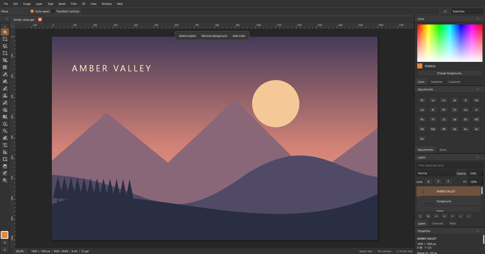

# Serika PhotoEdit

An open-source desktop photo editor built with C++20 and Qt 6.8 Widgets. Serika combines a native, dockable interface with layered editing, high-precision RGB, masks and familiar Photoshop-style shortcuts.

**Version 0.0.1 is an early release.** It provides working editing workflows, with substantial limits in specialist tools and interchange. See the [implementation status](docs/IMPLEMENTATION-STATUS.md) and [format fidelity notes](src/io/README.md).



## Download

Get the Windows x64 build from the [v0.0.1 release](https://github.com/serika-dev/SerikaPhotoEdit/releases/tag/v0.0.1):

- [Portable ZIP](https://github.com/serika-dev/SerikaPhotoEdit/releases/download/v0.0.1/SerikaPhotoEdit-0.0.1-win64.zip) — extract the entire archive, then open `bin/SerikaPhotoEdit.exe`.
- [MSI installer](https://github.com/serika-dev/SerikaPhotoEdit/releases/download/v0.0.1/SerikaPhotoEdit-0.0.1-win64.msi) — includes an optional SPE/PSD/PSB file-association feature.
- [Source ZIP](https://github.com/serika-dev/SerikaPhotoEdit/archive/refs/tags/v0.0.1.zip) or [source tarball](https://github.com/serika-dev/SerikaPhotoEdit/archive/refs/tags/v0.0.1.tar.gz).
- [SHA-256 checksums](https://github.com/serika-dev/SerikaPhotoEdit/releases/download/v0.0.1/SHA256SUMS.txt) for the Windows downloads.

The Windows packages include the required runtime libraries; a separate Qt installation is unnecessary. The executable and MSI are **unsigned**. Windows 11 x64 has been tested; other Windows versions and architectures have not. MSI payload extraction was checked, but normal installation, file-association changes and uninstall still need an acceptance run. [Release notes](docs/releases/0.0.1.md) include validation details.

## Start editing

Home includes the original layered **Amber Valley** demo. Open an image, add a layer, choose Brush (`B`), paint, and undo with `Ctrl+Z`. Save layered work as **SPE**; use File → Export for a flattened image. Keep SPE as your master document: PSD export uses raster compatibility layers and private Serika tags for some editable fields.

Crop (`C`) previews changes until Enter applies them; Escape cancels. Free Transform (`Ctrl+T`) follows the same commit/cancel pattern. Space temporarily pans, and Alt samples a brush color. Shortcuts can be remapped and exported; see the [keyboard reference](docs/KEYBOARD-SHORTCUTS.md).

## Features

- Document tabs, detachable windows, dockable panels, workspaces, command palette, recent files and four themes with original Serika icons.
- Sparse 256 × 256 tiles; 8-bit, 16-bit and float RGB; copy-on-write history; pixel, text, shape, group, adjustment and smart-object layers.
- CPU compositing with 27 blend modes, clipping, group isolation/pass-through, adjustments and layer effects.
- Brush, eraser, clone/heal, gradient/fill, selection and path tools; text and vector shapes; guides, rulers, zoom/pan and interactive Liquify.
- Raster/vector masks with density, feather and linking; high-precision selection coverage; Select and Mask previews, edge brush and output modes; saved selection channels and layer comps.
- Crop and perspective crop previews, ratios, output size, overlays, straighten and automatic bounds detection; inline transforms; Patch and Content-Aware Move with actual selection transport.
- Checksummed, atomically saved SPE/SPEB; original PSD/PSB import/export; LibRaw RAW import and Develop; common raster formats, TGA, float HDR, SVG rasterization and PDF page import.
- CPU filters, retained-source smart-filter stacks, selectable History Brush sources, Fade, action recording/playback and headless folder batch processing.
- Configurable Photoshop-style shortcuts with conflict detection, tool scopes, held modifiers, tool cycles and JSON import/export.

## Build from source

Requires **CMake 3.25+**, a **C++20 compiler**, Ninja or another CMake generator, and **Qt 6.8+** with Core, Gui, Widgets, PrintSupport, Svg and Test. Qt Image Formats supplies optional image codecs; Qt Pdf enables PDF import. Dynamically linked LibRaw and zlib are detected when available. RAW import is unavailable without LibRaw; `SERIKA_WITH_RAW=OFF` explicitly disables its discovery.

```sh
git clone https://github.com/serika-dev/SerikaPhotoEdit.git
cd SerikaPhotoEdit
cmake -S . -B build -G Ninja -DCMAKE_BUILD_TYPE=Release -DCMAKE_PREFIX_PATH="<Qt-kit-directory>" -DSERIKA_WARNINGS_AS_ERRORS=ON
cmake --build build --parallel
ctest --test-dir build --output-on-failure
```

Use a Qt kit and dependencies matching your compiler and architecture. On Windows, put the Qt runtime and matching compiler on PATH; an MSVC build needs a Visual Studio developer shell. The tested configuration is Qt 6.8.3, MinGW GCC 13.1, LibRaw 0.22.2 and zlib 1.3.1, all x64. [CONTRIBUTING.md](CONTRIBUTING.md) provides platform-specific setup, test and packaging commands.

## Platform coverage

| Platform | Build/package route | Verified for 0.0.1 |
| --- | --- | --- |
| Windows x64 | Qt desktop kit, CMake/Ninja; portable ZIP and WiX 3 MSI | Windows 11 x64 build, tests and package smoke checks |
| Windows ARM64 | Matching ARM64 Qt kit and compiler | No build or device validation |
| macOS Intel / Apple Silicon | Qt SDK; app bundle and CPack DMG; `scripts/package-macos.sh` | Recipes only; no binary, signing or notarization validation |
| Linux | Qt 6.8+ SDK/packages; TGZ/DEB/RPM; AppImage, Flatpak and Nix recipes | Recipes only; no Linux build or runtime validation |
| Alpine / FreeBSD | Native Qt 6.8+ and compiler; Alpine requires `SERIKA_ALPINE=ON` | Experimental, unverified |

Many distributions ship Qt older than 6.8, so check the selected SDK. The [CI workflow](.github/workflows/build.yml) defines Windows, macOS and Ubuntu jobs; those targets do not establish platform support until their builds and runtime checks pass. No macOS/Linux release binaries are supplied for 0.0.1.

## Validation and limits

The Windows Release build passed with compiler warnings treated as errors. All eight CTest suites passed, with **227 QtTest checks**: 79 core, 37 I/O, 8 UI, 34 canvas, 13 actions, 14 shortcuts, 21 masks and 21 workflows. Counts include lifecycle slots and data-driven rows. Native UI, portable launch, headless batch, ZIP integrity and MSI administrative extraction were also checked. See the [validation record](docs/RELEASE-VALIDATION.md) and [benchmark measurements](docs/performance.json).

Serika does not have full Photoshop parity. Content-aware tools use local CPU algorithms; embedded smart-object subdocuments, comprehensive Adobe descriptors, full typography, CMYK/Lab editing, professional ICC/proof workflows, advanced multi-layer transforms and GPU acceleration remain limited or absent. Many operations allocate full images despite the tiled model; canvas creation is capped at 80 million pixels. Test results cover the exercised behaviors, rather than every image, camera or external PSD/PSB file.

## Headless actions

Actions are JSON documents with a `steps` array. The [included example](examples/web-export.speaction) resizes images and applies an exposure adjustment:

```powershell
./bin/SerikaPhotoEdit.exe --batch ./share/serika-photoedit/examples/web-export.speaction input-folder output-folder
```

Run this command from the extracted portable package. Batch writes SPE files, reports invalid parameters or unsupported commands, and rolls back failed playback. GUI recording captures supported commands and accepted settings, rather than arbitrary pointer gestures.

## Contribute and license

Bug reports and focused pull requests are welcome. Read [CONTRIBUTING.md](CONTRIBUTING.md) for build instructions and useful report details, and [CHANGELOG.md](CHANGELOG.md) for release history.

Application code and original Serika icons are [MIT licensed](LICENSE). Qt, LibRaw, codecs and compiler runtimes retain their own licenses; see [third-party notices](docs/THIRD-PARTY.md) and the bundled license texts.
