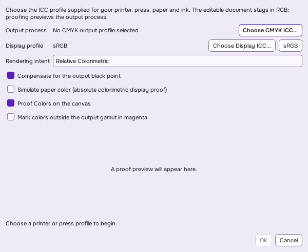

# ICC proofing and CMYK output

Serika PhotoEdit uses the dynamically linked LittleCMS core library to convert RGB image colors through ICC profiles into an actual CMYK output process. The editable layers remain RGB. The canvas proof is a display image, and enabling it does not change the source layers, masks, document ICC profile or saved RGB composite.

## Set up a proof

1. Open **View > Proof Setup...**. Choosing **Image > Mode > CMYK** also opens this setup; it does not change the editable document to a native CMYK model.
2. Choose the **CMYK output ICC** supplied for the intended printer or press, ink and paper. No generic or guessed printer profile is shipped. RGB profiles and CMYK device links are rejected as output-process profiles.
3. Choose the separation rendering intent: Perceptual, Relative Colorimetric, Saturation or Absolute Colorimetric. Black-point compensation is an independent setting implemented by LittleCMS.
4. Optionally choose an **RGB display ICC**. The default is sRGB. Serika does not automatically discover an operating-system monitor profile or calibrate a monitor; select an appropriate profile and use a calibrated display for useful physical predictions.
5. Enable **Proof Colors** to preview the process, **Simulate paper color** to use an absolute-colorimetric display proof, and **Gamut Warning** to mark colors outside the output profile's gamut in magenta. Gamut warnings use the backend's ICC gamut-check transform, not an RGB saturation threshold.

The source is the document's embedded RGB ICC profile. If none is present, an image's RGB color space is used, falling back to sRGB for untagged pixels. An invalid or non-RGB source profile causes conversion to fail; it is not silently interpreted as RGB. The chosen output and display ICC bytes, names and proof options are embedded in native document metadata, so moving the document does not depend on the original profile paths. Proof setup and toggles participate in document undo/redo. The status message names the active output profile and intent.

The preview applies the selected separation intent and optional black-point compensation from source to the output process, then simulates that process on the selected display profile. Paper simulation switches the final display leg to Absolute Colorimetric; it does not change the exported separations. Preview alpha is retained. Invalid proof settings leave the ordinary image visible; export reports the error and writes no replacement file.

## Export actual CMYK pixels

**File > Export > Export CMYK TIFF...** converts the flattened document composite through the selected ICC output transform. Choose 8-bit or 16-bit ink precision. Transparency is flattened over white before conversion. CMYK values represent process-ink coverage: zero is no ink and the maximum integer sample is 100% ink.

The TIFF contains interleaved Cyan, Magenta, Yellow and Black samples, `PhotometricInterpretation=Separated`, `InkSet=CMYK`, four ink names, four samples per pixel, the actual output ICC profile and the document's resolution. It is an uncompressed, single-strip classic TIFF. It contains no alpha channel or editable layers. Export uses an atomic replacement file; invalid settings or a failed write preserve any existing destination.

**Export CMYK Separations...** creates a new directory with:

- `Cyan.tif`, `Magenta.tif`, `Yellow.tif`, `Black.tif`: grayscale coverage plates at the selected ink precision and document resolution. White is no ink; black is full ink. These are coverage plates, not grayscale ICC color conversions.
- `output.icc`: the exact ICC profile used for the separation transform.
- `manifest.json`: channel order, dimensions, precision, resolution, profile description/SHA-256, rendering intent, black-point compensation and paper background.

The separation directory must be new. Files are assembled in a temporary sibling directory and moved into place when complete, so an existing set is not overwritten or partly updated. An export does not replace the RGB document or change its save target.

## Backend, limits and validation

The Windows development dependency is built from the official **LittleCMS 2.19.1** release. Its runtime reports encoded API version 2.19.0 because the upstream hotfix kept `LCMS_VERSION=2190`. The core library is MIT licensed; its license is included in `resources/licenses/LittleCMS2.txt`. No GPL LittleCMS plugins are enabled. Windows deployment includes `liblcms2.dll`; Linux and macOS use the dynamically linked platform LittleCMS library. Builds without the backend report proofing and CMYK conversion as unavailable. Release builds can require it with `SERIKA_REQUIRE_CMYK=ON`.

ICC profiles are bounded to 16 MiB and validated by LittleCMS after header/length checks. Proofing requires a CMYK output-class profile with both usable separation and reverse process transforms. Export uses its separation transform. Device links, malformed/truncated profiles, unsupported intents, empty images and unsupported channel precision are rejected. Sample buffers are bounded to 512 MiB, and the working RGBA16 conversion limit is 67,108,864 pixels. Large images currently require exporting a smaller composite. Classic TIFF is limited to 4 GiB, although the sample-buffer bound is reached first.

RGB 8-bit and 16-bit sources are transformed at 16-bit working precision. Floating-point/HDR sources are clipped to the normalized integer range for this print-preview/export path; apply an appropriate develop or tone adjustment before print output. The editable floating-point layers are retained. The implementation does not add native editable CMYK channels, Lab editing, CMYK PSD output, spot inks, overprint/trapping, a custom black-generation/total-ink-limit editor, automatic profile installation, monitor calibration, spectral ink simulation or a commercial RIP. Black generation and ink limits come from the selected output ICC. Print color still depends on correct profiles and the actual output process.

`color_management_tests` generates a clearly marked, test-only CMYK ICC LUT profile in memory; that profile is never installed or offered as a printer preset. The tests compare all four ICC intents, both ink precisions and black-point-compensation states against independent LittleCMS transforms. They also compare paper/gamut proof flags, preserve alpha and source layers, verify ICC/native metadata round trips, inspect TIFF CMYK tags and exact ink bytes, inspect all four coverage plates and their manifest, and exercise malformed profiles, wrong profile spaces/classes, bounds, atomic destination preservation and existing-directory errors.

## Primary references and reproducible dependency

- [LittleCMS official release 2.19.1](https://github.com/mm2/Little-CMS/releases/tag/lcms2.19.1), [core license](https://github.com/mm2/Little-CMS/blob/lcms2.19.1/LICENSE), [proofing transform implementation](https://github.com/mm2/Little-CMS/blob/lcms2.19.1/src/cmsxform.c).
- [LittleCMS 2.19 tutorial](https://github.com/mm2/Little-CMS/blob/lcms2.19.1/doc/LittleCMS2.19%20tutorial.pdf) and [public API](https://github.com/mm2/Little-CMS/blob/lcms2.19.1/include/lcms2.h).
- [Adobe TIFF 6.0 specification hosted by ITU](https://www.itu.int/itudoc/itu-t/com16/tiff-fx/docs/tiff6.pdf), including separated CMYK photometric interpretation and ink tags.

Official source archive: `https://github.com/mm2/Little-CMS/archive/refs/tags/lcms2.19.1.zip`.

SHA-256: `8b7fdc5a708d9f5f41baeecafd2c32b993f0614448f2533eea5deaf841ea1c78`.

Build the core shared library with `LCMS2_BUILD_SHARED=ON`, `LCMS2_BUILD_STATIC=OFF`, `LCMS2_BUILD_TOOLS=OFF`, `LCMS2_BUILD_TESTS=OFF`, and both GPL plugin options left off. CMake installs the imported target `lcms2::lcms2`, headers, import library and runtime. On Windows the local paths are `.tools/deps/install/include/lcms2.h`, `.tools/deps/install/lib/liblcms2.dll.a`, and `.tools/deps/install/bin/liblcms2.dll`. The dependency helper `scripts/build-lcms.ps1` reproduces the pinned build; application CMake enables `SERIKA_HAVE_LCMS2` when the backend is linked.

Native saves retain profiles in JSON metadata, whose existing total header limit is 16 MiB. Large combined profiles or other metadata can exceed that limit after base64 encoding; the atomic save reports the limit and preserves an existing file.
