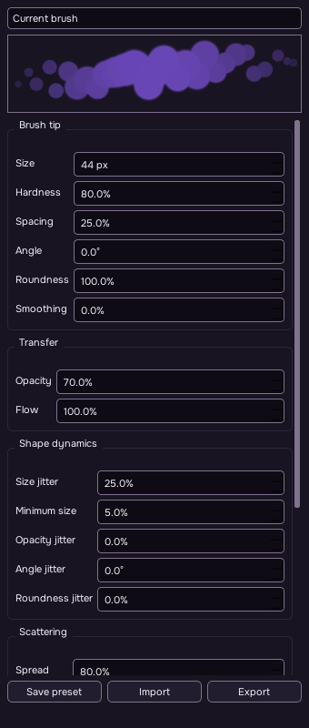
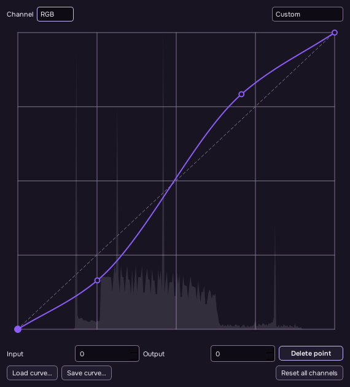
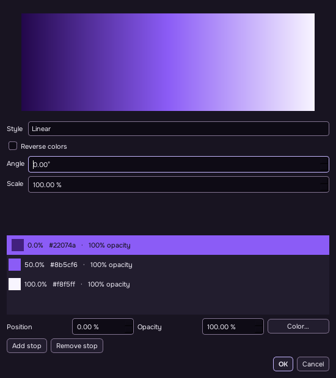

# Expanded editing workflows

These features are in the unreleased source and local preview build. Published
v0.0.1 packages have the earlier feature set. The [implementation inventory](IMPLEMENTATION-STATUS.md)
records the wider editor and its remaining limits.

## Select and arrange layers

Ctrl-click layers to toggle selections; Shift-click selects a range. The Layers
panel shows the selected count. Duplicate, delete, group, ungroup and stack-order
commands operate on the selection in one undo step. A selected group includes its
children without applying an operation to them twice.

Drag with Move to translate the selected roots together. Arrow keys nudge by one
pixel and Shift-arrow by ten. Clicking an already selected member keeps the
selection. Escape cancels a drag, and undo restores it as one gesture. A single
targeted unlinked mask moves independently.

Use **Layer → Align Selected Layers → Align To** to choose selected content bounds,
the canvas or a pixel selection. Six alignment commands and eight distribution
commands, including equal horizontal/vertical gaps, are available. Distribution
requires at least three independent targets. A locked target or ancestor stops the
whole operation. Content bounds exclude effects; unlinked masks retain their world
position. Auto-Align currently centers selected content and does not register photos.

Multi-selection IDs are not recorded in Actions. Unsupported multi-selection
operations are skipped by the recorder with a status message; native undo still
covers the whole operation.

## Edit Smart Object contents

Use **File → Place Embedded** or **Place Linked**, or convert a layer using
**Layer → Smart Objects**. Edit Contents opens a document tab with editable native
layers. Saving that tab applies its content to the parent Smart Object while
retaining parent transforms, masks, effects and Smart Filters. Save the parent
document to retain the updated embedded content on disk. Save As in a contents tab
exports a copy.

For a linked object, Save writes the linked original and updates the parent cache.
Parent undo restores the cache, but cannot undo the external file write. If the
linked original changed externally, or the parent was replaced/relinked, reopen
Edit Contents before saving. A closed parent does not discard the contents tab;
Save As can still export it.

Replace Contents preserves the existing placement when source dimensions change.
Relink, Update Linked Content, Embed Linked and Export Contents are also available.
Embedded native documents have a 512 MB payload cap. PSD keeps editable state in
private Serika blocks; Photoshop and other readers receive raster fallback layers.

## Tune and save brushes

Open **Window → Brush Settings**. Size, hardness, opacity and flow stay synchronized
with the toolbar and brush shortcuts. The panel also provides spacing, angle,
roundness, smoothing, size/opacity/angle/roundness jitter, scatter/count, pressure,
tilt and stroke-direction controls. The preview displays the current dynamics.

Save named presets locally, or import/export a `.sbrush.json` library. These are
Serika presets; Adobe ABR import, sampled/texture tips and dual brushes remain
unimplemented. Tablet pressure and tilt paths still need physical hardware testing.
Each stroke freezes its preset and carries dab spacing between input events, so
subdividing a straight gesture does not change density or seeded randomness.

## Shape tone with Curves

Open Curves from Adjustments or Image → Adjustments. Choose RGB for the master
curve or Red, Green or Blue for a channel. Click to add points, drag them, or edit
Input and Output numerically. Arrow keys move the selected point; Shift changes
the step to 10. Delete removes an interior point. Existing custom endpoint
positions are retained when reopening a curve.

The histogram and curve update with the image preview. Built-in curve presets,
reset, and native `.specurve` save/load are available. Apply creates or edits the
adjustment through the existing undo workflow; Cancel leaves the document alone.

## Make editable fills

**Layer → New Fill Layer** provides Solid Color, Gradient Fill and Pattern Fill.
Reopen a selected fill using **Edit Fill** or its Properties button.

Gradient Fill supports Linear, Radial, Angle, Reflected and Diamond styles. Add
color stops, set their positions and opacity, reverse the ramp and adjust angle or
scale. Gradient Map uses the same stop editor to map image luminance through a
color/opacity ramp.

Pattern Fill repeats an embedded image tile; load a PNG/JPEG/WebP/BMP/TIFF and
adjust scale/angle. Tiles imported through the editor are limited to 512 × 512 px.
Small source tiles retain their dimensions. Fills preserve native output depth,
remain editable in SPE, and round-trip through Serika's private PSD state.

## Remaining large gaps

This work expands core editing; it does not establish full Photoshop parity.
Major outstanding areas include semantic/generative AI models, complete Adobe
PSD descriptors, advanced typography and text warp, CMYK/Lab and proofing,
unclipped HDR adjustments, video editing, GPU/out-of-core processing, advanced
brush tips, comprehensive plugin compatibility and photo registration. The detailed
inventory distinguishes implemented behavior from reduced or absent workflows.
