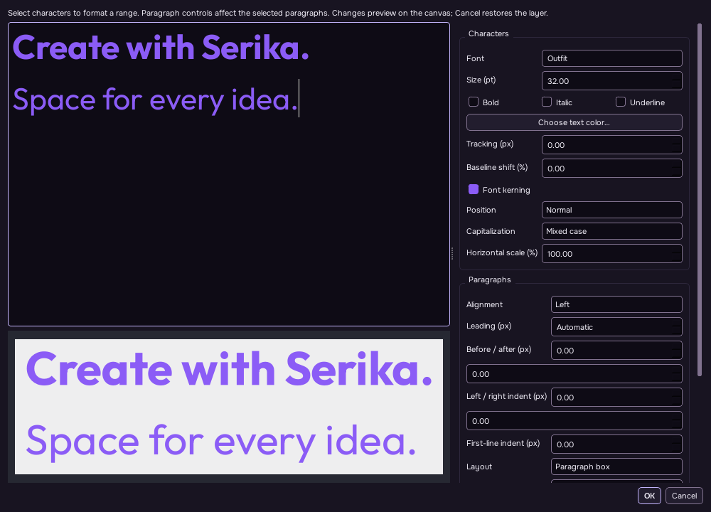

# Editable typography



Serika keeps editable text as Unicode plain text with explicit character spans and paragraph settings. It does not parse HTML or fetch embedded images, stylesheets, font files, or other external resources from typography parameters.

## Editing

Create a text layer with the Type tool, then use **Type → Edit Typography…** (or **Edit Text…**). Select characters to apply mixed font family, size, bold, italic, underline, color including alpha, tracking, font kerning, baseline shift, superscript/subscript, capitalization, or horizontal scale. With no selection, character controls format the current word; at an empty insertion position they set the insertion format.

Paragraph controls act on the selected paragraphs: left/center/right/justified alignment, fixed leading or automatic line height, before/after spacing, left/right indentation, and first-line indentation. Paragraph boxes wrap to their stored width; point text has no width constraint. The editor displays the formatted source and a shared-renderer preview. Canvas changes during editing belong to one transaction. Accept commits one undo step; Cancel restores the original layer and saved-state revision. Accepting an unchanged editor preserves the exact original parameters and legacy rendering.

**Type → Type on Path…** chooses a shape or Pen path already in the document. Its geometry is copied into the text layer's local coordinates; later editing the source shape does not alter the stored type path. Start distance and reverse direction remain editable in the Type dialog. The layout shapes the text with Qt, then places individual glyph outlines along the path's arc length and tangent. Text extending beyond the path is omitted. Line breaks become spaces while following a path. **Clear Type Path** restores the normal text layout.

**Convert to Shape** creates editable glyph outlines from the shared layout. A single color produces one Shape layer; multiple colors produce a group of Shape layers. It retains the original group position, masks, opacity, and effects, and supports undo back to editable type. Font outline rendering may differ slightly from hinted screen text at small sizes.

## Rendering and persistence

Plain legacy text keeps its existing QPainter rendering, including upright per-character vertical type. Rich typography uses `QTextDocument` and its Qt shaping/layout pipeline. Path placement and outline conversion obtain shaped glyph positions from `QTextLayout` and outlines from `QRawFont`. Rich content bounds use the same outline geometry; transformed layers keep the existing rendered-image bounds path. This supports Qt's installed-font fallback and Unicode shaping, rather than a custom character-by-character Latin layout.

Native SPE/SPEB and Serika's private PSD/PSB model blocks preserve the text, font, and `Layer.parameters.typography` data. Other PSD editors see the rendered text pixels; this implementation does not synthesize Adobe native text-engine descriptors. Fonts are not embedded, so unavailable fonts can change layout when reopening on another machine or operating system.

## Parameter format

`Layer.text` is the source. Formatting is stored in `Layer.parameters.typography`:

```json
{
  "version": 1,
  "layout": "paragraph",
  "width": 420,
  "spans": [
    {"start": 0, "length": 5, "family": "Arial", "size": 36,
     "bold": true, "color": "#ffff3366", "tracking": 2,
     "kerning": true, "baseline": 0}
  ],
  "paragraphs": [
    {"position": 0, "alignment": "center", "leading": 52,
     "before": 0, "after": 12, "leftIndent": 8,
     "rightIndent": 8, "firstIndent": 0}
  ]
}
```

Span `start`/`length` and paragraph `position` use UTF-16 indices, matching Qt text cursors. `size` is in points; `pixelSize` is an alternative. Tracking, paragraph width, spacing, indentation, and leading are in document pixels. Leading `0` means automatic. Baseline shift is a percentage of font height; positive values raise text. Colors use Qt color strings; `#AARRGGBB` includes alpha. Optional `verticalAlignment` accepts `super` or `sub`. `stretch` is a horizontal percentage; `capitalization` stores Qt's `QFont::Capitalization` value. Saved spans include a Qt font string and explicit spacing, capitalization, stretch, and kerning fields to preserve formatting that a font string alone omits.

Optional `path` is an array of QPainterPath elements `[type,x,y]`: `0` moves, `1` draws a line, and a cubic is one `2` control point followed by two `3` control/end points. `pathOffset` is arc distance in pixels and `pathReverse` reverses progression and tangent orientation. Geometry is bounded to finite coordinates to reject malformed path data.

## Limits and validation

This is a substantial editable text implementation, not complete Photoshop typography parity. It does not provide Adobe text-descriptor interoperability, font embedding or packaging, OpenType feature/variable-axis editors, optical kerning, hyphenation dictionaries, advanced justification/composer algorithms, threaded text frames, text wrapping around objects, warp envelopes, or a glyph browser. Font kerning uses the font's metrics. Rich vertical orientation rotates a laid-out paragraph by 90 degrees; full upright vertical CJK layout is not implemented. Color/bitmap glyphs without vector outlines cannot be placed on a path or converted completely to shapes. Curved-path underline/strike decorations are omitted. Path placement does not deform individual glyph shapes.

The dedicated `typography_tests` suite covers exact legacy rendering, actual mixed sizes/styles/colors, paragraph metrics, formatting round trips, tracking geometry, cubic path placement, literal HTML/resource rejection, shared bounds, native and Serika PSD persistence, dialog reopening, live preview cancellation/one-step undo, ancestor locks, and mixed-color shape conversion. Integrated build and test results are recorded by the root validation workflow; writing this document does not itself confirm those checks passed. Manual cross-platform font fidelity and comparison with Adobe's text compositor remain pending.

Qt API references: [QTextDocument](https://doc.qt.io/qt-6.8/qtextdocument.html), [QTextCursor](https://doc.qt.io/qt-6.8/qtextcursor.html), [QTextCharFormat](https://doc.qt.io/qt-6.8/qtextcharformat.html), [QTextBlockFormat](https://doc.qt.io/qt-6.8/qtextblockformat.html), [QTextLayout](https://doc.qt.io/qt-6.8/qtextlayout.html), [QRawFont](https://doc.qt.io/qt-6.8/qrawfont.html), and [QPainterPath](https://doc.qt.io/qt-6.8/qpainterpath.html).
